# 🏗️ System Architecture

*Comprehensive overview of LezerPrint's system design and technical decisions*

---

## 📖 Table of Contents

- [Overview](#-overview)
- [High-Level Architecture](#-high-level-architecture)
- [Frontend Architecture](#-frontend-architecture)
- [Backend Architecture](#-backend-architecture)
- [Database Design](#-database-design)
- [Real-Time Communication](#-real-time-communication)
- [File Management](#-file-management)
- [Authentication & Security](#-authentication--security)
- [Scalability Design](#-scalability-design)
- [Technology Decisions](#-technology-decisions)
- [Performance Considerations](#-performance-considerations)
- [Future Enhancements](#-future-enhancements)

---

## 🔍 Overview

LezerPrint is designed as a modern, scalable 3D printer management system using a microservice-ready architecture with clear separation of concerns. The system emphasizes real-time capabilities, security, and user experience while maintaining high code quality and maintainability.

### Core Principles

- **Separation of Concerns** - Clear boundaries between presentation, business logic, and data
- **Real-Time First** - WebSocket-driven architecture for live updates
- **Security by Design** - Built-in security at every layer
- **Scalability** - Designed to handle growth from single users to enterprise
- **Developer Experience** - Type-safe, well-documented, testable code
- **User Experience** - Responsive, intuitive, and accessible interface

### System Goals

| Goal | Implementation |
|------|----------------|
| **Real-Time Monitoring** | WebSocket communication with automatic reconnection |
| **File Management** | Secure upload/download with metadata extraction |
| **Print Control** | Reliable printer communication with error handling |
| **Analytics** | Comprehensive metrics and reporting system |
| **Multi-User Support** | Role-based access control and user management |
| **High Availability** | Stateless design with horizontal scaling support |

---

## 🌐 High-Level Architecture

```mermaid
graph TB
    User[👤 User] --> LB[🔧 Load Balancer<br/>nginx]
    
    LB --> FE[🖥️ Frontend<br/>Next.js 15]
    LB --> BE[⚙️ Backend API<br/>Node.js + Express]
    
    FE <--> BE
    FE <-.-> WS[🔌 WebSocket<br/>Socket.io]
    BE <--> WS
    
    BE --> DB[(🗄️ PostgreSQL<br/>Primary Database)]
    BE --> Redis[(🔴 Redis<br/>Cache & Sessions)]
    BE --> FS[📁 File Storage<br/>Local/S3]
    
    BE --> Printer[🖨️ 3D Printer<br/>Serial/USB]
    BE --> Camera[📹 Camera<br/>USB/IP Camera]
    
    subgraph "External Services"
        Email[📧 SMTP Server]
        Monitoring[📊 Sentry/Monitoring]
        CDN[🌍 CDN]
    end
    
    BE --> Email
    BE --> Monitoring
    FE --> CDN
```



### Component Relationships

#### Frontend Layer
- **Next.js Application** - Server-side rendered React application
- **Static Assets** - Optimized images, fonts, and resources
- **Client-Side Routing** - Dynamic navigation with App Router
- **Real-Time Updates** - WebSocket client for live data

#### Backend Layer
- **API Server** - RESTful API with Express.js
- **WebSocket Server** - Socket.io for real-time communication
- **Business Logic** - Service layer with domain logic
- **Data Access** - Prisma ORM for database operations

#### Data Layer
- **PostgreSQL** - Primary relational database
- **Redis** - Caching and session storage
- **File System** - Binary file storage (local or cloud)

#### Hardware Layer
- **3D Printer** - Serial/USB communication
- **Camera System** - USB/IP camera integration
- **External APIs** - Third-party service integration

---

## 🖥️ Frontend Architecture

### Technology Stack

```typescript
// Core Framework
Next.js 15.5.2      // React framework with App Router
React 19.1.1        // UI library with concurrent features
TypeScript 5.9.2    // Type safety and developer experience

// Styling & UI
Tailwind CSS 3.3.0  // Utility-first CSS framework
Framer Motion 12.23 // Animation library
Lucide React 0.542  // Icon library
Recharts 3.1.2      // Data visualization

// State Management
Zustand 5.0.8       // Client state management
TanStack Query 5.87 // Server state management
React Hook Form 7.62 // Form state management

// 3D & Visualization
Three.js 0.180.0    // 3D rendering
React Three Fiber 9.3 // React bindings for Three.js
React Three Drei 10.7 // Three.js helpers

// Communication
Socket.io Client 4.8 // Real-time communication
Axios 1.11.0        // HTTP client
```

### Application Structure

```
frontend/src/
├── app/                    # Next.js App Router
│   ├── (auth)/            # Authentication routes
│   │   ├── login/         # Login page
│   │   └── register/      # Registration page
│   ├── (dashboard)/       # Main application
│   │   ├── analytics/     # Analytics pages
│   │   ├── files/         # File management
│   │   ├── jobs/          # Print job management
│   │   ├── camera/        # Live monitoring
│   │   ├── terminal/      # G-code terminal
│   │   └── settings/      # Configuration
│   ├── api/               # API routes (Next.js)
│   ├── globals.css        # Global styles
│   ├── layout.tsx         # Root layout
│   └── page.tsx           # Home page
├── components/            # Reusable components
│   ├── analytics/         # Chart and metrics components
│   ├── camera/           # Camera and monitoring
│   ├── printer/          # Printer control components
│   ├── settings/         # Configuration components
│   └── ui/               # Base UI components
├── lib/                  # Utilities and configurations
│   ├── api.ts            # API client configuration
│   ├── auth.ts           # Authentication utilities
│   ├── utils.ts          # General utilities
│   └── validations.ts    # Form validation schemas
├── services/             # API service layer
│   ├── api/              # API client methods
│   ├── socket/           # WebSocket handling
│   └── storage/          # Local storage utilities
├── stores/               # Zustand state stores
│   ├── auth.ts           # Authentication state
│   ├── printer.ts        # Printer state
│   └── ui.ts             # UI state
└── styles/              # Additional styles
    └── components.css    # Component-specific styles
```

### Component Architecture

#### Design System

```typescript
// Base UI Components
Button, Input, Modal, Card, Badge, Toast, LoadingSpinner

// Layout Components
Header, Sidebar, Dashboard, Container, Grid

// Feature Components
PrinterStatus, FileUpload, JobManager, AnalyticsChart

// Page Components
LoginPage, DashboardPage, FilesPage, AnalyticsPage
```

#### State Management Strategy

```typescript
// Client State (Zustand)
interface AppState {
  // UI State
  theme: 'light' | 'dark' | 'system';
  sidebarOpen: boolean;
  currentPage: string;
  
  // User State
  user: User | null;
  isAuthenticated: boolean;
  permissions: Permission[];
  
  // Printer State
  selectedPrinter: string | null;
  printerStatus: PrinterStatus;
  isConnected: boolean;
}

// Server State (React Query)
// - File listings and details
// - Print job data
// - Analytics data
// - User preferences
// - System settings
```

#### Routing Strategy

```typescript
// App Router Structure
app/
├── layout.tsx              # Root layout with providers
├── page.tsx                # Landing page
├── (auth)/                 # Auth route group
│   ├── layout.tsx          # Auth-specific layout
│   ├── login/page.tsx      # Login page
│   └── register/page.tsx   # Registration page
└── (dashboard)/            # Protected route group
    ├── layout.tsx          # Dashboard layout
    ├── page.tsx            # Dashboard home
    ├── files/              # File management
    ├── jobs/               # Print jobs
    ├── analytics/          # Analytics
    ├── camera/             # Camera monitoring
    ├── terminal/           # G-code terminal
    └── settings/           # User settings
```

---

## ⚙️ Backend Architecture

### Technology Stack

```typescript
// Core Framework
Node.js 20+          // Runtime environment
Express.js 5.1.0     // Web framework
TypeScript 5.9.2     // Type safety

// Database & ORM
Prisma 6.15.0        // Database toolkit and ORM
PostgreSQL 15+       // Primary database
Redis 7+             // Caching and sessions

// Communication
Socket.io 4.8.1      // Real-time WebSocket
Cors 2.8.5           // Cross-origin requests

// Security
JWT 9.0.2            // JSON Web Tokens
bcrypt 6.0.0         // Password hashing
Helmet 8.1.0         // Security headers

// File Handling
Multer 2.0.2         // File upload handling
Sharp 0.34.3         // Image processing

// Validation
Zod 4.1.5            // Runtime type validation

// Hardware Communication
SerialPort 13.0.0    // Printer communication
```

### Service Architecture

```
backend/src/
├── server.ts              # Application entry point
├── api/                   # API route handlers
│   └── routes/           # Organized by feature
│       ├── auth.routes.ts
│       ├── files.routes.ts
│       ├── printer.routes.ts
│       ├── jobs.routes.ts
│       └── analytics.routes.ts
├── controllers/           # Request/response handling
│   ├── auth.controller.ts
│   ├── files.controller.ts
│   └── printer.controller.ts
├── services/             # Business logic layer
│   ├── auth/            # Authentication services
│   ├── files/           # File management
│   ├── printer/         # Printer communication
│   ├── jobs/            # Print job management
│   ├── analytics/       # Data analysis
│   └── notifications/   # Notification handling
├── middleware/          # Express middleware
│   ├── auth.middleware.ts
│   ├── validation.middleware.ts
│   └── error.middleware.ts
├── lib/                 # Utilities and database
│   ├── prisma.ts        # Database client
│   ├── redis.ts         # Cache client
│   └── logger.ts        # Logging utilities
├── websocket/           # Socket.io handlers
│   ├── printer.handlers.ts
│   ├── job.handlers.ts
│   └── camera.handlers.ts
└── types/               # TypeScript type definitions
    ├── api.types.ts
    ├── printer.types.ts
    └── job.types.ts
```

### Service Layer Design

#### Authentication Service

```typescript
class AuthService {
  async register(userData: RegisterData): Promise<AuthResult>
  async login(credentials: LoginData): Promise<AuthResult>
  async refreshToken(token: string): Promise<AuthResult>
  async logout(userId: string): Promise<void>
  async validateToken(token: string): Promise<User | null>
}
```

#### Printer Service

```typescript
class PrinterService {
  async getStatus(): Promise<PrinterStatus>
  async sendCommand(command: string): Promise<string>
  async startPrint(jobId: string): Promise<void>
  async pausePrint(): Promise<void>
  async resumePrint(): Promise<void>
  async cancelPrint(): Promise<void>
  async setTemperature(targets: TemperatureTargets): Promise<void>
  async emergencyStop(): Promise<void>
}
```

#### File Service

```typescript
class FileService {
  async uploadFile(file: UploadedFile, userId: string): Promise<File>
  async getFile(fileId: string, userId: string): Promise<File | null>
  async deleteFile(fileId: string, userId: string): Promise<boolean>
  async getUserFiles(userId: string, filters: FileFilters): Promise<FilePage>
  async generateThumbnail(file: File): Promise<string>
  async extractMetadata(file: File): Promise<FileMetadata>
}
```

### API Design Patterns

#### RESTful Endpoints

```typescript
// Resource-based URLs
GET    /api/files              # List files
POST   /api/files              # Create file
GET    /api/files/:id          # Get file
PUT    /api/files/:id          # Update file
DELETE /api/files/:id          # Delete file

// Nested resources
GET    /api/files/:id/jobs     # Get jobs for file
POST   /api/files/:id/print    # Start print from file

// Action-based endpoints
POST   /api/printer/home       # Home printer
POST   /api/printer/emergency-stop  # Emergency stop
```

#### Response Format

```typescript
// Success Response
interface ApiResponse<T> {
  success: true;
  data: T;
  meta?: ResponseMeta;
}

// Error Response
interface ApiError {
  success: false;
  error: {
    code: string;
    message: string;
    details?: any;
  };
}
```

---

## 🗄️ Database Design

### Schema Overview


### Table Design Rationale

#### Users Table
```sql
CREATE TABLE users (
  id UUID PRIMARY KEY DEFAULT gen_random_uuid(),
  email VARCHAR(255) UNIQUE NOT NULL,
  username VARCHAR(50) UNIQUE NOT NULL,
  password_hash VARCHAR(255) NOT NULL,
  role user_role DEFAULT 'VIEWER',
  is_active BOOLEAN DEFAULT true,
  preferences JSONB DEFAULT '{}',
  created_at TIMESTAMP DEFAULT CURRENT_TIMESTAMP,
  updated_at TIMESTAMP DEFAULT CURRENT_TIMESTAMP,
  last_login_at TIMESTAMP
);

-- Indexes for performance
CREATE INDEX idx_users_email ON users(email);
CREATE INDEX idx_users_username ON users(username);
CREATE INDEX idx_users_role ON users(role);
```

#### Files Table
```sql
CREATE TABLE files (
  id UUID PRIMARY KEY DEFAULT gen_random_uuid(),
  user_id UUID NOT NULL REFERENCES users(id) ON DELETE CASCADE,
  original_name VARCHAR(255) NOT NULL,
  file_name VARCHAR(255) NOT NULL,
  file_type file_type NOT NULL,
  file_size BIGINT NOT NULL,
  metadata JSONB,
  thumbnail_url VARCHAR(500),
  print_count INTEGER DEFAULT 0,
  created_at TIMESTAMP DEFAULT CURRENT_TIMESTAMP,
  updated_at TIMESTAMP DEFAULT CURRENT_TIMESTAMP
);

-- Indexes for queries
CREATE INDEX idx_files_user_id ON files(user_id);
CREATE INDEX idx_files_type ON files(file_type);
CREATE INDEX idx_files_created ON files(created_at DESC);
CREATE INDEX idx_files_user_type ON files(user_id, file_type);
```

#### Print Jobs Table
```sql
CREATE TABLE print_jobs (
  id UUID PRIMARY KEY DEFAULT gen_random_uuid(),
  user_id UUID NOT NULL REFERENCES users(id),
  file_id UUID NOT NULL REFERENCES files(id),
  sliced_file_id UUID REFERENCES sliced_files(id),
  status job_status NOT NULL DEFAULT 'QUEUED',
  progress FLOAT DEFAULT 0,
  started_at TIMESTAMP,
  completed_at TIMESTAMP,
  estimated_time INTEGER,
  actual_time INTEGER,
  filament_used FLOAT,
  cost DECIMAL(10,2),
  notes TEXT,
  error_message TEXT,
  created_at TIMESTAMP DEFAULT CURRENT_TIMESTAMP,
  updated_at TIMESTAMP DEFAULT CURRENT_TIMESTAMP
);

-- Performance indexes
CREATE INDEX idx_jobs_user_status ON print_jobs(user_id, status);
CREATE INDEX idx_jobs_status_created ON print_jobs(status, created_at);
CREATE INDEX idx_jobs_file_id ON print_jobs(file_id);
```

### Data Consistency

#### Constraints
- **Foreign Key Constraints** - Maintain referential integrity
- **Check Constraints** - Validate data ranges (temperatures, dimensions)
- **Unique Constraints** - Prevent duplicate usernames/emails
- **Not Null Constraints** - Ensure required fields are populated

#### Transactions
```typescript
// Atomic operations using Prisma transactions
await prisma.$transaction(async (tx) => {
  // Update job status
  const job = await tx.printJob.update({
    where: { id: jobId },
    data: { status: 'COMPLETED', completedAt: new Date() }
  });
  
  // Update user statistics
  await tx.user.update({
    where: { id: job.userId },
    data: { 
      totalPrints: { increment: 1 },
      lastActivity: new Date()
    }
  });
  
  // Log completion event
  await tx.printEvent.create({
    data: {
      jobId: job.id,
      eventType: 'JOB_COMPLETED',
      message: 'Print completed successfully'
    }
  });
});
```

---

## 🔌 Real-Time Communication

### WebSocket Architecture

```typescript
// Server-side Socket.io setup
import { Server } from 'socket.io';

const io = new Server(httpServer, {
  cors: {
    origin: process.env.FRONTEND_URL,
    methods: ["GET", "POST"]
  },
  transports: ['websocket', 'polling']
});

// Namespace organization
const printerNamespace = io.of('/printer');
const jobNamespace = io.of('/jobs');
const cameraNamespace = io.of('/camera');

// Authentication middleware
io.use(async (socket, next) => {
  const token = socket.handshake.auth.token;
  const user = await validateToken(token);
  if (user) {
    socket.userId = user.id;
    socket.userRole = user.role;
    next();
  } else {
    next(new Error('Authentication failed'));
  }
});
```

### Event System

#### Printer Events
```typescript
// Server emits to clients
socket.emit('printer:status', {
  state: 'printing',
  temperatures: {
    hotend: { current: 200, target: 200 },
    bed: { current: 60, target: 60 }
  },
  position: { x: 100, y: 100, z: 50 },
  progress: { completion: 45.5, timeLeft: 3600 }
});

// Client emits to server
socket.emit('printer:command', {
  command: 'G28',
  wait: true
});
```

#### Job Events
```typescript
// Job status updates
socket.emit('job:status', {
  jobId: 'uuid',
  status: 'PRINTING',
  progress: 67.5,
  estimatedTimeLeft: 1800
});

// Print completion
socket.emit('job:completed', {
  jobId: 'uuid',
  actualTime: 7200,
  filamentUsed: 25.5,
  success: true
});
```

### Real-Time Data Flow


---

## 📁 File Management

### File Upload Architecture

```typescript
// Multer configuration for file uploads
const upload = multer({
  storage: diskStorage({
    destination: './uploads',
    filename: (req, file, cb) => {
      const uniqueName = `${Date.now()}-${Math.round(Math.random() * 1E9)}`;
      const ext = path.extname(file.originalname);
      cb(null, `${uniqueName}${ext}`);
    }
  }),
  limits: {
    fileSize: 50 * 1024 * 1024, // 50MB
    files: 1
  },
  fileFilter: (req, file, cb) => {
    const allowedTypes = ['stl', 'gcode', 'obj', '3mf'];
    const ext = path.extname(file.originalname).toLowerCase().slice(1);
    cb(null, allowedTypes.includes(ext));
  }
});
```

### Metadata Extraction

```typescript
class FileProcessor {
  async processSTL(filePath: string): Promise<STLMetadata> {
    const buffer = await fs.readFile(filePath);
    return {
      triangles: this.countTriangles(buffer),
      dimensions: this.calculateDimensions(buffer),
      volume: this.calculateVolume(buffer),
      surfaceArea: this.calculateSurfaceArea(buffer)
    };
  }
  
  async processGCode(filePath: string): Promise<GCodeMetadata> {
    const content = await fs.readFile(filePath, 'utf-8');
    return {
      estimatedTime: this.parseTimeEstimate(content),
      filamentLength: this.parseFilamentUsage(content),
      layerCount: this.countLayers(content),
      toolTemperatures: this.parseTemperatures(content)
    };
  }
}
```

### Storage Strategy

#### Local Storage
```typescript
// File system organization
uploads/
├── files/           # Original uploaded files
│   ├── stl/        # STL models
│   ├── gcode/      # G-code files
│   └── obj/        # OBJ models
├── thumbnails/     # Generated thumbnails
├── processed/      # Processed/converted files
└── temp/          # Temporary upload staging
```

#### Cloud Storage (S3 Compatible)
```typescript
import AWS from 'aws-sdk';

class CloudStorage {
  private s3 = new AWS.S3({
    accessKeyId: process.env.AWS_ACCESS_KEY,
    secretAccessKey: process.env.AWS_SECRET_KEY,
    region: process.env.AWS_REGION
  });
  
  async uploadFile(file: Buffer, key: string): Promise<string> {
    const result = await this.s3.upload({
      Bucket: process.env.S3_BUCKET,
      Key: key,
      Body: file,
      ServerSideEncryption: 'AES256'
    }).promise();
    
    return result.Location;
  }
}
```

---

## 🔐 Authentication & Security

### Authentication Flow


### JWT Implementation

```typescript
// JWT token generation
function generateTokens(user: User): TokenPair {
  const payload = {
    userId: user.id,
    email: user.email,
    role: user.role
  };
  
  const accessToken = jwt.sign(payload, process.env.JWT_SECRET, {
    expiresIn: '15m',
    issuer: 'lezerprint-api',
    audience: 'lezerprint-client'
  });
  
  const refreshToken = jwt.sign(
    { userId: user.id, type: 'refresh' },
    process.env.JWT_REFRESH_SECRET,
    { expiresIn: '7d' }
  );
  
  return { accessToken, refreshToken };
}

// JWT validation middleware
function authenticateToken(req: Request, res: Response, next: NextFunction) {
  const authHeader = req.headers['authorization'];
  const token = authHeader && authHeader.split(' ')[1];
  
  if (!token) {
    return res.status(401).json({ error: 'Access token required' });
  }
  
  jwt.verify(token, process.env.JWT_SECRET, (err, decoded) => {
    if (err) {
      return res.status(403).json({ error: 'Invalid or expired token' });
    }
    req.user = decoded;
    next();
  });
}
```

### Role-Based Access Control

```typescript
enum UserRole {
  ADMIN = 'ADMIN',
  OPERATOR = 'OPERATOR',
  VIEWER = 'VIEWER'
}

// Permission matrix
const permissions = {
  [UserRole.ADMIN]: [
    'users:read', 'users:write', 'users:delete',
    'printers:read', 'printers:write', 'printers:control',
    'files:read', 'files:write', 'files:delete',
    'jobs:read', 'jobs:write', 'jobs:control',
    'settings:read', 'settings:write'
  ],
  [UserRole.OPERATOR]: [
    'printers:read', 'printers:control',
    'files:read', 'files:write',
    'jobs:read', 'jobs:write', 'jobs:control'
  ],
  [UserRole.VIEWER]: [
    'printers:read',
    'files:read',
    'jobs:read'
  ]
};

// Authorization middleware
function requirePermission(permission: string) {
  return (req: Request, res: Response, next: NextFunction) => {
    const user = req.user as AuthUser;
    const userPermissions = permissions[user.role] || [];
    
    if (userPermissions.includes(permission)) {
      next();
    } else {
      res.status(403).json({ error: 'Insufficient permissions' });
    }
  };
}
```

### Security Headers

```typescript
import helmet from 'helmet';

app.use(helmet({
  contentSecurityPolicy: {
    directives: {
      defaultSrc: ["'self'"],
      scriptSrc: ["'self'", "'unsafe-inline'", "*.googleapis.com"],
      styleSrc: ["'self'", "'unsafe-inline'", "*.googleapis.com"],
      imgSrc: ["'self'", "data:", "*.amazonaws.com"],
      connectSrc: ["'self'", "wss:", "*.sentry.io"],
      fontSrc: ["'self'", "*.googleapis.com", "*.gstatic.com"],
      objectSrc: ["'none'"],
      mediaSrc: ["'self'"],
      frameSrc: ["'none'"]
    }
  },
  crossOriginEmbedderPolicy: false,
  hsts: {
    maxAge: 31536000,
    includeSubDomains: true,
    preload: true
  }
}));
```

---

## 📈 Scalability Design

### Horizontal Scaling

#### Load Balancer Configuration
```nginx
upstream backend {
    least_conn;
    server backend1:3001 weight=3;
    server backend2:3001 weight=3;
    server backend3:3001 weight=2;
    
    # Health checks
    check interval=3000 rise=2 fall=3 timeout=2000;
}

upstream frontend {
    least_conn;
    server frontend1:3000;
    server frontend2:3000;
    server frontend3:3000;
}
```

#### Database Scaling
```typescript
// Read replicas for analytics
const readOnlyPrisma = new PrismaClient({
  datasources: {
    db: {
      url: process.env.DATABASE_READ_URL
    }
  }
});

// Use read replica for heavy queries
async function getAnalyticsData(userId: string) {
  return readOnlyPrisma.printJob.findMany({
    where: { userId },
    include: { file: true },
    orderBy: { createdAt: 'desc' }
  });
}
```

#### Caching Strategy
```typescript
// Multi-layer caching
class CacheService {
  // L1: In-memory cache (per instance)
  private memoryCache = new Map();
  
  // L2: Redis cache (shared)
  private redis = new Redis(process.env.REDIS_URL);
  
  async get<T>(key: string): Promise<T | null> {
    // Check memory cache first
    if (this.memoryCache.has(key)) {
      return this.memoryCache.get(key);
    }
    
    // Check Redis cache
    const cached = await this.redis.get(key);
    if (cached) {
      const value = JSON.parse(cached);
      this.memoryCache.set(key, value);
      return value;
    }
    
    return null;
  }
  
  async set<T>(key: string, value: T, ttl = 3600): Promise<void> {
    // Set in both caches
    this.memoryCache.set(key, value);
    await this.redis.setex(key, ttl, JSON.stringify(value));
  }
}
```

### Performance Optimization

#### Database Optimization
```sql
-- Partitioning for large tables
CREATE TABLE print_events_2024_01 PARTITION OF print_events
FOR VALUES FROM ('2024-01-01') TO ('2024-02-01');

-- Materialized views for analytics
CREATE MATERIALIZED VIEW user_print_stats AS
SELECT 
  user_id,
  COUNT(*) as total_prints,
  AVG(actual_time) as avg_print_time,
  SUM(filament_used) as total_filament,
  COUNT(*) FILTER (WHERE status = 'COMPLETED') * 100.0 / COUNT(*) as success_rate
FROM print_jobs
GROUP BY user_id;

-- Refresh strategy
CREATE OR REPLACE FUNCTION refresh_user_stats()
RETURNS void AS $$
BEGIN
  REFRESH MATERIALIZED VIEW CONCURRENTLY user_print_stats;
END;
$$ LANGUAGE plpgsql;
```

#### API Optimization
```typescript
// Response compression
import compression from 'compression';
app.use(compression());

// Request rate limiting
import rateLimit from 'express-rate-limit';
const limiter = rateLimit({
  windowMs: 15 * 60 * 1000, // 15 minutes
  max: 100, // limit each IP to 100 requests per windowMs
  standardHeaders: true,
  legacyHeaders: false
});
app.use('/api/', limiter);

// Response pagination
interface PaginatedResponse<T> {
  data: T[];
  pagination: {
    page: number;
    limit: number;
    total: number;
    pages: number;
    hasNext: boolean;
    hasPrev: boolean;
  };
}
```

---

## 🧠 Technology Decisions

### Frontend Technology Choices

#### Next.js vs Alternative Frameworks

| Criterion | Next.js | React SPA | Vue.js | Angular |
|-----------|---------|-----------|---------|---------|
| **SEO** | ✅ SSR/SSG | ❌ Client-side | ✅ Nuxt.js | ✅ Universal |
| **Performance** | ✅ Optimized | ⚠️ Bundle size | ✅ Small size | ❌ Large bundle |
| **Developer Experience** | ✅ Excellent | ✅ Good | ✅ Good | ⚠️ Complex |
| **Ecosystem** | ✅ Rich | ✅ Rich | ⚠️ Growing | ✅ Complete |
| **Learning Curve** | ✅ Moderate | ✅ Low | ✅ Low | ❌ Steep |

**Decision**: Next.js chosen for SSR capabilities, excellent developer experience, and strong React ecosystem.

#### State Management

| Solution | Pros | Cons | Use Case |
|----------|------|------|---------|
| **Zustand** | Simple, TypeScript-first, minimal boilerplate | Smaller ecosystem | Client state |
| **React Query** | Server state specialization, caching, background updates | Learning curve | Server state |
| **Redux Toolkit** | Mature, predictable, DevTools | Boilerplate, complexity | Complex state |
| **Context API** | Built-in, simple | Performance issues, prop drilling | Theme, auth |

**Decision**: Zustand + React Query for optimal developer experience and performance.

### Backend Technology Choices

#### Runtime Environment

| Runtime | Pros | Cons | Decision Factor |
|---------|------|------|----------------|
| **Node.js** | JavaScript ecosystem, fast development, good for I/O | Single-threaded CPU tasks | ✅ Chosen for rapid development |
| **Python** | ML libraries, readable code, extensive ecosystem | Slower execution, GIL | ❌ Performance concerns |
| **Go** | Fast execution, excellent concurrency, small binaries | Smaller ecosystem, learning curve | ❌ Development speed |
| **Rust** | Memory safety, extreme performance, modern | Steep learning curve, smaller ecosystem | ❌ Complexity |

#### Database Selection

| Database | Pros | Cons | Use Case |
|----------|------|------|---------|
| **PostgreSQL** | ACID compliance, JSON support, mature, extensions | Complex setup | ✅ Primary database |
| **MongoDB** | Flexible schema, horizontal scaling | No ACID, eventual consistency | ❌ Need consistency |
| **MySQL** | Mature, widespread support | Limited JSON support | ❌ Feature limitations |
| **SQLite** | Simple, embedded, serverless | Limited concurrency | ❌ Multi-user app |

**Decision**: PostgreSQL for ACID compliance, JSON support, and excellent performance.

---

## ⚡ Performance Considerations

### Frontend Performance

#### Bundle Optimization
```typescript
// Dynamic imports for code splitting
const AnalyticsDashboard = dynamic(
  () => import('./AnalyticsDashboard'),
  { loading: () => <AnalyticsLoadingSkeleton /> }
);

// Tree shaking optimization
import { calculatePrintTime } from '@/lib/utils'; // ✅ Named import
import * as utils from '@/lib/utils'; // ❌ Imports everything
```

#### Image Optimization
```typescript
// Next.js Image component
import Image from 'next/image';

<Image
  src="/printer-thumbnail.jpg"
  alt="3D Printer"
  width={400}
  height={300}
  priority={false}
  placeholder="blur"
  blurDataURL="data:image/jpeg;base64,..."
/>
```

#### Virtualization for Large Lists
```typescript
// React Window for large file lists
import { FixedSizeList as List } from 'react-window';

function FileList({ files }: { files: File[] }) {
  const Row = ({ index, style }: { index: number; style: CSSProperties }) => (
    <div style={style}>
      <FileItem file={files[index]} />
    </div>
  );

  return (
    <List
      height={600}
      itemCount={files.length}
      itemSize={80}
      overscanCount={5}
    >
      {Row}
    </List>
  );
}
```

### Backend Performance

#### Database Query Optimization
```typescript
// Efficient queries with proper indexing
const files = await prisma.file.findMany({
  where: { 
    userId,
    fileType: 'STL' // Uses idx_files_user_type
  },
  select: {
    id: true,
    originalName: true,
    fileSize: true,
    createdAt: true,
    // Don't select large fields like metadata unless needed
  },
  orderBy: { createdAt: 'desc' }, // Uses idx_files_created
  take: 20,
  skip: (page - 1) * 20
});
```

#### Connection Pooling
```typescript
// Prisma connection pooling
const prisma = new PrismaClient({
  datasources: {
    db: {
      url: process.env.DATABASE_URL
    }
  },
  // Connection pool configuration
  log: ['query', 'error'],
  errorFormat: 'pretty'
});

// Manual pool configuration for high load
const pool = new Pool({
  connectionString: process.env.DATABASE_URL,
  max: 20, // Maximum connections
  idleTimeoutMillis: 30000,
  connectionTimeoutMillis: 2000
});
```

#### Background Job Processing
```typescript
// Queue system for heavy operations
import Bull from 'bull';

const fileProcessingQueue = new Bull('file processing', process.env.REDIS_URL);

// Add job to queue
fileProcessingQueue.add('process-stl', {
  fileId: file.id,
  filePath: file.filePath
}, {
  attempts: 3,
  backoff: 'exponential',
  removeOnComplete: 10,
  removeOnFail: 5
});

// Process jobs
fileProcessingQueue.process('process-stl', async (job) => {
  const { fileId, filePath } = job.data;
  const metadata = await extractSTLMetadata(filePath);
  await updateFileMetadata(fileId, metadata);
});
```

---

## 🔮 Future Enhancements

### Planned Architectural Improvements

#### Microservices Architecture
```typescript
// Service decomposition plan
services/
├── user-service/          # User management and auth
├── file-service/          # File upload and management
├── printer-service/       # Printer communication
├── job-service/          # Print job management
├── analytics-service/     # Data analysis and reporting
├── notification-service/  # Email and push notifications
└── gateway-service/      # API gateway and routing
```

#### Event-Driven Architecture
```typescript
// Event sourcing for audit trail
interface PrintJobEvent {
  id: string;
  jobId: string;
  eventType: 'CREATED' | 'STARTED' | 'PAUSED' | 'COMPLETED' | 'FAILED';
  payload: any;
  timestamp: Date;
  userId: string;
}

// Event bus for service communication
class EventBus {
  async publish(event: DomainEvent): Promise<void>
  async subscribe(eventType: string, handler: EventHandler): Promise<void>
}
```

#### Advanced Caching
```typescript
// Multi-level caching strategy
class CacheManager {
  // Browser cache (Service Worker)
  async cacheStaticAssets(): Promise<void>
  
  // CDN cache (CloudFlare/AWS CloudFront)
  async invalidateGlobalCache(pattern: string): Promise<void>
  
  // Application cache (Redis)
  async cacheApiResponse(key: string, data: any): Promise<void>
  
  // Database cache (PostgreSQL shared_buffers)
  async optimizeQueryPlan(query: string): Promise<void>
}
```

### Technology Roadmap

#### Short Term (3-6 months)
- **Real-time collaboration** - Multiple users controlling same printer
- **Advanced analytics** - ML-based failure prediction
- **Mobile app** - React Native companion app
- **Plugin system** - Third-party integrations

#### Medium Term (6-12 months)
- **Multi-printer support** - Manage printer farms
- **Cloud deployment** - AWS/GCP/Azure support
- **Advanced security** - OAuth2, SAML integration
- **Performance optimization** - Query optimization, caching

#### Long Term (12+ months)
- **AI integration** - Automated print optimization
- **IoT integration** - Smart printer ecosystem
- **Blockchain** - Decentralized file sharing
- **AR/VR support** - Immersive monitoring

---

## 📚 Additional Resources

### Architecture Documentation
- [**System Requirements**](INSTALLATION.md#system-requirements)
- [**Deployment Guide**](DEPLOYMENT.md)
- [**Security Guidelines**](SECURITY.md)
- [**Performance Optimization**](DEVELOPMENT_GUIDE.md#performance-optimization)

### External Resources
- [**Prisma Best Practices**](https://www.prisma.io/docs/guides/performance-and-optimization)
- [**Next.js Performance**](https://nextjs.org/docs/advanced-features/measuring-performance)
- [**Socket.io Scaling**](https://socket.io/docs/v4/scaling-up/)
- [**PostgreSQL Performance Tuning**](https://wiki.postgresql.org/wiki/Performance_Optimization)

### Related Documentation
- [**API Reference**](API_REFERENCE.md) - Complete API documentation
- [**Development Guide**](DEVELOPMENT_GUIDE.md) - Developer workflows
- [**User Manual**](USER_MANUAL.md) - End-user documentation

---

**Architecture is living documentation** 📋 As the system evolves, this document will be updated to reflect the current state and future plans. For questions about architectural decisions, please [open a discussion](https://github.com/Avi-Lezerovich/LezerPrint/discussions).